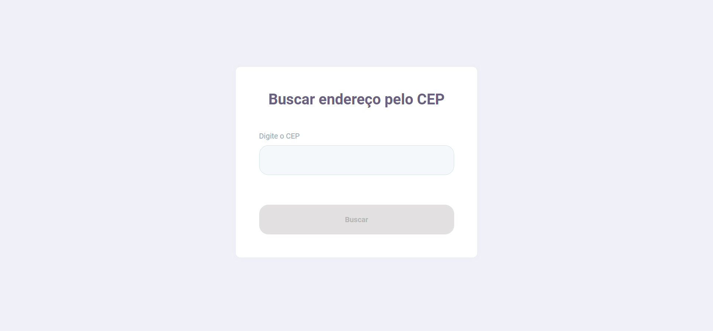
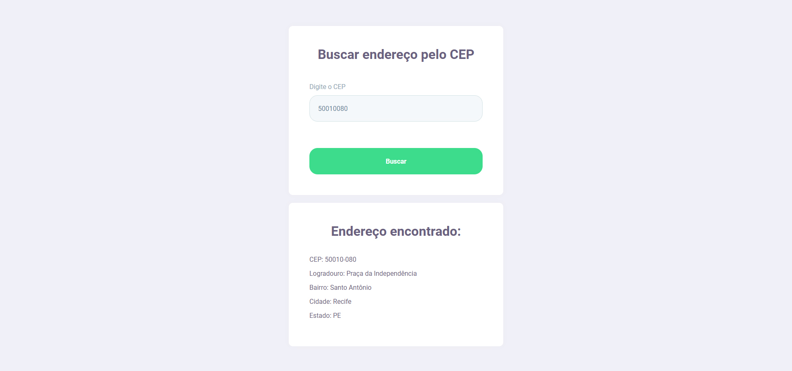

# Busca CEP

## 💻 Projeto

É um projeto para estudo pessoal e tem como finalidade encontrar o endereço a partir de um CEP informado pelo usuário.

## 🚀 Tecnologias

Esse projeto foi desenvolvido com as seguintes tecnologias:

- [Node.js](https://nodejs.org/en/)
- [React](https://reactjs.org)

Módulo utilizado para pesquisa de CEP:

- [node-cep-correios](https://www.npmjs.com/package/node-cep-correios)

## 🔖 Layout

  

  

